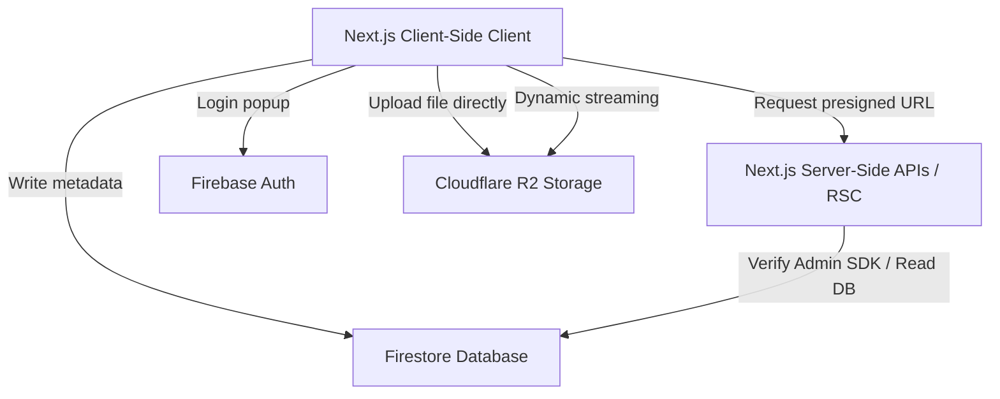

# Nukriti+ Application Architecture Spec

Nukriti+ is a private Netflix-inspired streaming platform designed to host, secure, and watch life memories. This document defines the codebase architecture, file structure, API specification, database schemas, and component logic.

---

## 1. System Overview

Nukriti+ is built as a hybrid full-stack web application leveraging Next.js (App Router), Firebase (Authentication & Firestore Database), and Cloudflare R2 (S3-compatible object storage).



* **Frontend**: Next.js 16 (React 19, Client & Server Components), Tailwind CSS, Framer Motion (Netflix-style smooth layout animations), Lucide icons.
* **Database (Firestore)**: Stores relational metadata for `videos` and `users`.
* **Object Storage (Cloudflare R2)**: Direct-to-R2 client uploads (presigned PUT) with browser-level media optimization. Supports MP4 byte-range progressive streaming and HLS playback.
* **Authentication**: Google Sign-in via client-side Firebase SDK, verified via server-side Security Rules and application guards.

---

## 2. Directory & File Structure

```text
nukritiplus/
├── firestore.rules          # Firestore security rules config
├── firebase.json            # Firebase CLI deployment mapping
├── package.json             # Application dependencies (Next.js, firebase, aws-sdk, etc.)
├── src/
│   ├── app/
│   │   ├── (public)/        # Public routes (accessible by authenticated viewers)
│   │   │   ├── page.tsx     # Homepage (Netflix Hero + category carousels)
│   │   │   └── search/      # Search page (live query filtering on title & category)
│   │   ├── admin/           # Admin Dashboard routes (protected by AdminGuard)
│   │   │   ├── categories/  # Admin view: categories & video counts
│   │   │   ├── dashboard/   # Admin stats (video, user, featured counters)
│   │   │   ├── uploads/     # Admin upload form (video + thumbnail R2/DB pipeline)
│   │   │   ├── videos/      # Admin view: table list of videos with deletion
│   │   │   └── layout.tsx   # Sidebar layout for Admin dashboard
│   │   ├── api/             # Next.js Server API endpoints
│   │   │   └── upload/
│   │   │       └── presign/ # POST endpoint: generates Cloudflare R2 presigned PUT URLs
│   │   ├── login/           # Login screen (Google Sign-In page)
│   │   ├── watch/           # Video streaming playback route
│   │   │   └── [id]/
│   │   │       └── page.tsx # Watch page (RSC loads video metadata from Firestore)
│   │   ├── layout.tsx       # Root layout containing AuthProvider & Navbar
│   │   └── globals.css      # Core styles & styling system
│   ├── components/
│   │   ├── auth/
│   │   │   └── AdminGuard.tsx  # React Client Wrapper restricting sub-routes to admins
│   │   ├── netflix/
│   │   │   └── VideoCarousel.tsx # Netflix-style slider with smooth hover scaling
│   │   └── player/
│   │       └── HLSPlayer.tsx # Cinematic HTML5 video player (supports native mp4 & HLS)
│   ├── lib/
│   │   ├── auth/
│   │   │   └── AuthContext.tsx  # React Context for Firebase User state & role hydration
│   │   ├── firebase/
│   │   │   ├── admin.ts     # Firebase Admin SDK initialization (Private Key PEM)
│   │   │   └── client.ts    # Firebase Client SDK initialization
│   │   └── firestore/
│   │       └── api.ts       # Server-side data fetching API for Firestore documents
```

---

## 3. Database Schema (Firestore)

Firestore utilizes two main collections.

### `users` (Collection)
* Document ID: `userId` (equivalent to Firebase Auth `uid`)
```json
{
  "email": "string",
  "role": "admin | viewer",
  "createdAt": "ISOString"
}
```

### `videos` (Collection)
* Document ID: Auto-generated string
```json
{
  "title": "string",
  "description": "string",
  "category": "string",
  "year": number,
  "videoUrl": "string",        // Public R2 download link
  "thumbnailUrl": "string",    // Public R2 image link
  "featured": boolean,         // True if pinned to the homepage Hero
  "createdAt": "ISOString"     // Upload timestamp
}
```

---

## 4. API Specification

### `POST /api/upload/presign`
Generates a short-lived presigned PUT URL directly to the Cloudflare R2 bucket to let the client upload media without hitting server size limitations.

* **Request Body**:
```json
{
  "filename": "string",       // e.g., "vacation.mp4"
  "contentType": "string"    // e.g., "video/mp4"
}
```

* **Response Body**:
```json
{
  "signedUrl": "string",     // Presigned upload target (expires in 1 hour)
  "publicUrl": "string"      // The URL where the file can be read publicly after upload
}
```

* **Backend Logic (`route.ts`)**:
  1. Receives request parameters.
  2. Generates a unique, sanitized file key using `crypto.randomUUID()` to prevent file collision in the R2 bucket.
  3. Commands the `S3Client` to sign a `PutObjectCommand` for the target R2 bucket and content type.
  4. Returns the `signedUrl` and public read URL.

---

## 5. Main Component Logic & Flows

### A. Authentication & Access Control Flow
* **File**: `AuthContext.tsx`
  - Initializes `onAuthStateChanged`. When a user authenticates, it attempts to fetch their document in the `/users` collection.
  - If a user document doesn't exist, it creates one with the default role `viewer` (configured securely inside `firestore.rules`).
* **File**: `AdminGuard.tsx`
  - Wraps all `/admin` routes.
  - Checks if the user's role in `AuthContext` is `admin`. If not, redirects them back to `/` or `/login`.

### B. Direct-to-R2 Upload Pipeline Flow
* **File**: `uploads/page.tsx`
  - **Video Selection**: When a video file is selected, standard HTML5 video metadata processes it, seeking to the halfway mark, drawing the frame to a canvas, and exporting a compressed JPEG thumbnail Blob automatically.
  - **Upload Execution**:
    1. Sends a `POST` request to `/api/upload/presign` for the thumbnail, gets a signed URL, and uploads it via `PUT`.
    2. Sends a `POST` request to `/api/upload/presign` for the video, gets a signed URL, and uploads it via `PUT`.
    3. Writes the compiled metadata (title, category, R2 video url, R2 thumbnail url, etc.) directly to the `videos` collection in Firestore.

### C. Live Query Search Flow
* **File**: `search/SearchClient.tsx`
  - Accept `initialVideos` from the Server Component page.
  - Monitors a textual query search input.
  - Performs case-insensitive client-side filters matching `video.title` and `video.category`, updating the responsive grid dynamically.

### D. Media Streaming Player Flow
* **File**: `HLSPlayer.tsx`
  - Contains full keyboard support and mouse move listening timeouts to control interface overlays.
  - **Playback Engine**:
    - Checks the source URL. If the URL does not contain `.m3u8` (meaning it's an `.mp4`, `.mov`, `.webm`, etc.), it directly binds `video.src = src` to stream natively.
    - If the URL does contain `.m3u8`, it binds `hls.js` to process segments dynamically.
